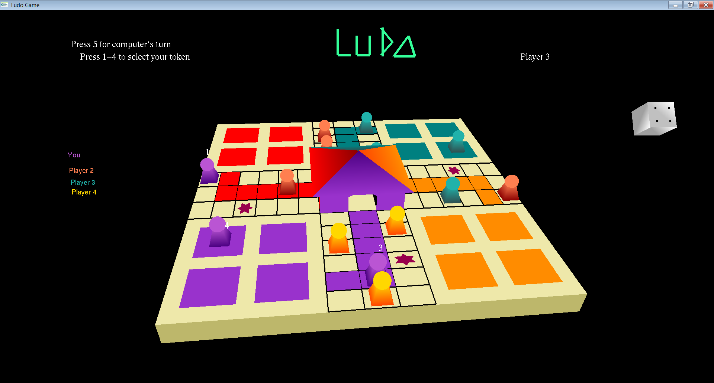

# 3D Ludo
An artificially intelligent, single-player classic ludo game. 

## Features and Rules
1. The game is played by only one user at a time against three computer players.
2. The user starts the game by making the first move.
3. The game is designed based on all the rules of a classic ludo game.
4. Everytime there is a turn change, the dice is automatically rolled and is displayed on the top-right corner of the screen.
5. The game board rotates 360 degrees to get a better view of the opponent's tokens.

## How to play
1. Keyboard keys:
   - Token 1, user : Press 1
   - Token 2, user : Press 2
   - Token 3, user : Press 3
   - Token 4, user : Press 4
   - Computer player : Press 5
   

## Installation
1. Requirements for executing the code:
   - Dev C++ IDE
   - glutMINGW32 folder (http://chortle.ccsu.edu/bloodshed/howtogl.html)
2. Configure Dev C++ to use glut libraries using the the instructions given here : (http://chortle.ccsu.edu/bloodshed/howtogl.html)
3. Create a new OpenGL project in Dev C++.
4. Change the properties of the project by adding the following libraries: 
   - libopengl32
   - libglu32
   - libglut32
5. Add a blank file to the project and copy the code in LudoCode.cpp
6. Run it.

