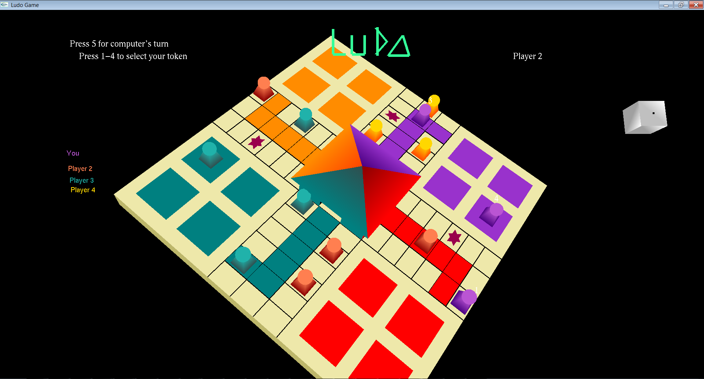
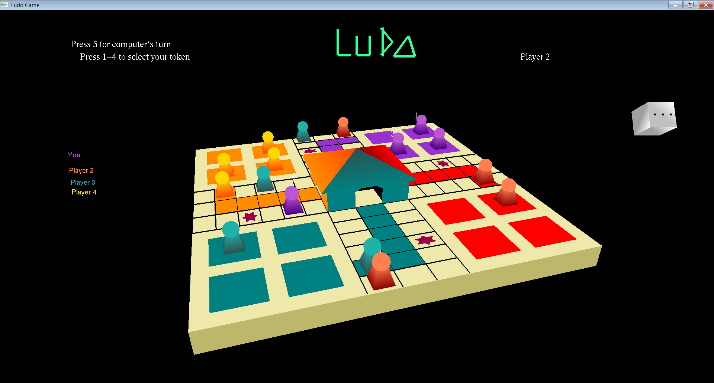

# 3D Ludo
An artificially intelligent, single-player classic ludo game. 

## Features and Rules
- The game is played by only one user at a time against three computer players.
- The user starts the game by making the first move.
- The game is designed based on all the rules of a classic ludo game.
- Everytime there is a turn change, the dice is automatically rolled and is displayed on the top-right corner of the screen.
- The game board rotates 360 degrees to get a better view of the opponent's tokens.

## How to play
- Keyboard keys:
  - Token 1, user : Press 1
  - Token 2, user : Press 2
  - Token 3, user : Press 3
  - Token 4, user : Press 4
  - Computer player : Press 5
   

## Installation 
### Running setup (for Windows only)
- Download setup.zip, unzip it and run setup.exe.
- Launch Ludo application by clicking on the shortcut icon and get ready to loose by our intelligent players!

### Executing the code
1. Requirements for executing the code:
   - Dev C++ IDE
   - glutMINGW32 folder (http://chortle.ccsu.edu/bloodshed/howtogl.html)
2. Configure Dev C++ to use glut libraries using the the instructions given here : (http://chortle.ccsu.edu/bloodshed/howtogl.html)
3. Create a new OpenGL project in Dev C++.
4. Change the properties of the project by adding the following libraries: 
   - libopengl32
   - libglu32
   - libglut32
5. Import the LudoCode.cpp file into your project and run it.
6. Run it.

